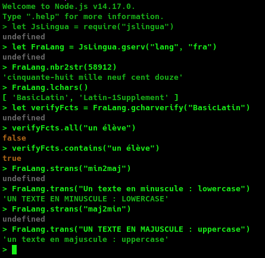
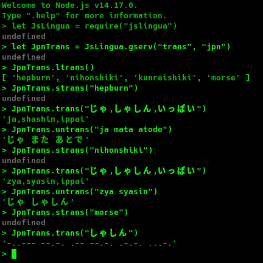
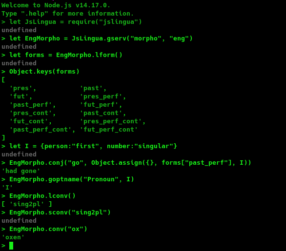
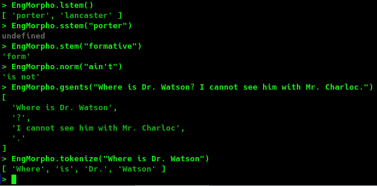

# JsLingua


[](https://nodei.co/npm/jslingua/)

[](https://kariminf.github.io/jslingua.web)
[](http://www.apache.org/licenses/LICENSE-2.0)
[](https://travis-ci.org/kariminf/jslingua)
[](https://www.npmjs.com/package/jslingua)

Javascript library for language processing.

## Functionalities

For now, there are 4 modules : Info, Lang, Trans and Morpho.

### Information about the language (Info)


### Basic language functions (Lang)

- Detection of language's characters
- Transforming numbers to strings (pronunciation)



### Transliteration (Trans)



### Morphology (Morpho)

Different morphological functions
  - Verb Conjugation
  - Stemming: deleting affixes (suffixes, prefixes and infixes)
  - Noun declension: from feminine to masculine and the inverse, from singular to plural, etc.
  - Text segmentation: text to sentences; sentences to words
  - Text normalization
  - Stop words filtering





To get the list of available functionalities, check [FCT.md](./FCT.md)

To get tutorials [Click here](https://github.com/kariminf/jslingua_docs/blob/master/doc/index.md)


## How to use?

### Use in Browser

You can either use it by downloading it via **NPM** or by using **UNPKG** CDN (content delivery network).
There are two versions:
- One file containing all the functions at once (not very large): it is usefull if you want to use all the functions in your website. Also, if you don't want to use ES6 asynchronuous import.
- Many files : not recomanded since the files are not minimized.

Here an example using UNPKG CDN
```javascript
<script type="text/javascript" src="https://unpkg.com/jslingua@latest/dist/jslingua.js"></script>
<script type="text/javascript">
  alert(JsLingua.version);
</script>
```

Here an example when you want to select the services at execution time.
```javascript
<script type="module">
  import JsLingua from "../../src/jslingua.mjs";
  window.JsLingua = JsLingua;
</script>
<script type="text/javascript">
  async function loadingAsync(){
    await Promise.all([
      JsLingua.load("[Service]", "[lang]"),
      JsLingua.load("[Service]", "[lang]"),
      ...
    ]);
    loading();
  }
  window.onload = loadingAsync;
</script>
```

### Use in Node

First of all, you have to install the package in your current project
```
npm install jslingua
```
Then, you can import it as follows :
```javascript
let JsLingua = require("jslingua");
```

### Get the services (Browser & Node)

You can call them one by one, if you know the services and their implemented languages.
For example, if you want to use Arabic implementation of "Morpho":

```javascript
//Get Arabic Morpho class
let AraMorpho = JsLingua.gserv("morpho", "ara");
```

Or, you can just loop over the services and test available languages.
For example, the "Info" service:
```javascript
//Get the list of languages codes which support the Info service
let langIDs = JsLingua.llang("info");
//Or: let langIDs = JsLingua.llang("info"); //list languages
let result = "";
for (let i = 0; i < langIDs.length; i++){
  let infoClass = JsLingua.gserv("info", langIDs[i]);
  result += i + "- " + infoClass.getName() + "\n";
}
```

Check [More](#more) section for more tutorials.

## Community

All the C's are here:

* [CREDITS](./CREDITS.md) : List of contributors
* [CONTRIBUTING](./CONTRIBUTING.md) : How to contribute to this project
* [CODE OF CONDUCT](./CODE_OF_CONDUCT.md) : Some recommendations must be followed for a healthy development environment.
* [CODE CONVENTION](./CODE_CONVENTION.md) : Some rules to follow while coding
* [CHANGELOG](./CHANGELOG.md) : Changes in every version


If you are looking to have fun, you are welcome to contribute.
If you think this project must have a business plan, please feel free to refer to [this project (click)](https://github.com/kariminf/tnbp)


## More

You can test the browser version on [https://kariminf.github.io/jslingua.web](https://kariminf.github.io/jslingua.web)

You can test nodejs version online on [https://runkit.com/npm/jslingua](https://runkit.com/npm/jslingua)

jsdoc generated API is located in [https://kariminf.github.io/jslingua.web/docs/](https://kariminf.github.io/jslingua.web/docs/)

Examples on how to use JsLingua are located in [https://github.com/kariminf/jslingua_docs](https://github.com/kariminf/jslingua_docs)

A tutorial on how to use JsLingua is located in [https://github.com/kariminf/jslingua_docs/blob/master/doc/index.md](https://github.com/kariminf/jslingua_docs/blob/master/doc/index.md)

A Youtube tutorial for JsLingua and nodejs is located in this list: [https://www.youtube.com/watch?v=piAysG5W55A&list=PLMNbVokbNS0cIjZxF8AnmgDfmu3XXddeq](https://www.youtube.com/watch?v=piAysG5W55A&list=PLMNbVokbNS0cIjZxF8AnmgDfmu3XXddeq)

## About the project

This project aims to afford some of the tasks related to languages, such as: detecting charsets, some transformations (majuscule to minuscule), verb conjugation, etc.
There are a lot of projects like this such as: [NLTK](https://github.com/nltk/nltk) (python), [OpenNLP](https://github.com/apache/opennlp) (Java), etc.
But, mostly, they are server side and needs some configurations before being put in action.

A lot of tasks doesn't need many resources such as stemming, tokenization, transliteration, etc.
When we use these toolkits in a web application, the server will do all of these tasks.
Why not exploit the users machines to do such tasks, and gain some benefits:
* The server will be relieved to do some other serious tasks.
* The number of communications will drop, resulting in a faster respond time which leads to a better user experience.
* The amount of exchanged data may drop; this case is applicable when we want to send a big text, then we tokenize it, stem it and remove stop words. This will decrease the size of data to be sent.
* Easy to configure and to integrate into your web pages.

Also, it can be used in server side using [node.js](https://github.com/nodejs/node).

The project's ambitions are:
* To deliver the maximum language-related tasks with a minimum of resources pushed down to the client.
* To benefit from oriented object programming (OOP) concepts so the code will be minimal and readable.
* To give the web-master the ability to choose witch tasks they want to use by using many modules instead of using one giant program.
* To afford good resources for those who want to learn javascript programming.
* **TO HAVE FUN**: programming is fun, spend time for useful things, happiness is when your work is helpful to others, more obstacles give more experience.

## Contributors


## License

Copyright (C) 2016-2021 Abdelkrime Aries

Licensed under the Apache License, Version 2.0 (the "License");
you may not use this file except in compliance with the License.
You may obtain a copy of the License at

http://www.apache.org/licenses/LICENSE-2.0

Unless required by applicable law or agreed to in writing, software
distributed under the License is distributed on an "AS IS" BASIS,
WITHOUT WARRANTIES OR CONDITIONS OF ANY KIND, either express or implied.
See the License for the specific language governing permissions and
limitations under the License.
